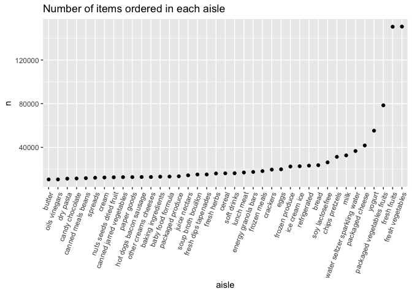
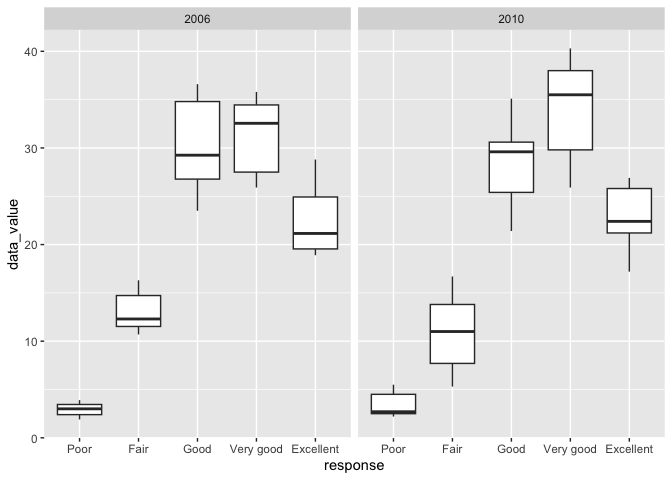

p8105_hw3_qs2261
================
Qinting Shen
2023-10-14

``` r
library(tidyverse)
```

    ## ── Attaching core tidyverse packages ──────────────────────── tidyverse 2.0.0 ──
    ## ✔ dplyr     1.1.3     ✔ readr     2.1.4
    ## ✔ forcats   1.0.0     ✔ stringr   1.5.0
    ## ✔ ggplot2   3.4.3     ✔ tibble    3.2.1
    ## ✔ lubridate 1.9.2     ✔ tidyr     1.3.0
    ## ✔ purrr     1.0.2     
    ## ── Conflicts ────────────────────────────────────────── tidyverse_conflicts() ──
    ## ✖ dplyr::filter() masks stats::filter()
    ## ✖ dplyr::lag()    masks stats::lag()
    ## ℹ Use the conflicted package (<http://conflicted.r-lib.org/>) to force all conflicts to become errors

### Problem 1

load the dataset `instacart`

``` r
library(p8105.datasets)
data("instacart")
```

`instacart` has 1384617 observations and 15 variables. This dataset
collects some information of orders from instacart, including
`order_id`, `user_id`, `order_hour_of_day` `days_since_prior_order`,
`product_name`, `aisle`, `department`, etc. It contains the information
of each order (e.g product name, number of product, the aisle it belongs
to, the department it belongs to, etc.) .

1.  How many aisles are there, and which aisles are the most items
    ordered from?

``` r
instacart |> 
  count(aisle) |> 
  arrange(desc(n))
```

    ## # A tibble: 134 × 2
    ##    aisle                              n
    ##    <chr>                          <int>
    ##  1 fresh vegetables              150609
    ##  2 fresh fruits                  150473
    ##  3 packaged vegetables fruits     78493
    ##  4 yogurt                         55240
    ##  5 packaged cheese                41699
    ##  6 water seltzer sparkling water  36617
    ##  7 milk                           32644
    ##  8 chips pretzels                 31269
    ##  9 soy lactosefree                26240
    ## 10 bread                          23635
    ## # ℹ 124 more rows

There are 134 aisles in this dataset. “fresh vegetables” are the most
items ordered from.

2.  Make a plot that shows the number of items ordered in each aisle,
    limiting this to aisles with more than 10000 items ordered.

``` r
instacart |> 
  count(aisle) |> 
  filter(n > 10000) |> 
  mutate(aisle = fct_reorder(aisle, n)) |> 
  ggplot(aes(x = aisle , y = n)) +
  geom_point() +
  labs( title = "Number of items ordered in each aisle") +
  theme(axis.text.x = element_text(angle = 70, hjust = 1))
```

<!-- -->

3.  Make a table showing the three most popular items in each of the
    aisles “baking ingredients”, “dog food care”, and “packaged
    vegetables fruits”. Include the number of times each item is ordered
    in your table.

``` r
instacart |> 
  filter(aisle == c("baking ingredients", "dog food care", "packaged vegetables fruits")) |> 
  group_by(aisle) |> 
  count(product_name) |> 
  mutate(rank = min_rank(desc(n))) |> 
  filter(rank <= 3) |> 
  arrange(desc(n)) |> 
  knitr::kable()
```

| aisle                      | product_name                                    |    n | rank |
|:---------------------------|:------------------------------------------------|-----:|-----:|
| packaged vegetables fruits | Organic Baby Spinach                            | 3324 |    1 |
| packaged vegetables fruits | Organic Raspberries                             | 1920 |    2 |
| packaged vegetables fruits | Organic Blueberries                             | 1692 |    3 |
| baking ingredients         | Light Brown Sugar                               |  157 |    1 |
| baking ingredients         | Pure Baking Soda                                |  140 |    2 |
| baking ingredients         | Organic Vanilla Extract                         |  122 |    3 |
| dog food care              | Organix Grain Free Chicken & Vegetable Dog Food |   14 |    1 |
| dog food care              | Organix Chicken & Brown Rice Recipe             |   13 |    2 |
| dog food care              | Original Dry Dog                                |    9 |    3 |

4.  Make a table showing the mean hour of the day at which Pink Lady
    Apples and Coffee Ice Cream are ordered on each day of the week;
    format this table for human readers (i.e. produce a 2 x 7 table).

``` r
instacart |> 
  filter(product_name %in% c("Pink Lady Apples", "Coffee Ice Cream")) |> 
  group_by(product_name, order_dow) |> 
  summarize(mean_hour = mean(order_hour_of_day)) |> 
  pivot_wider(
    names_from = order_dow,
    values_from = mean_hour
  ) |> 
  knitr::kable(digits = 2)
```

    ## `summarise()` has grouped output by 'product_name'. You can override using the
    ## `.groups` argument.

| product_name     |     0 |     1 |     2 |     3 |     4 |     5 |     6 |
|:-----------------|------:|------:|------:|------:|------:|------:|------:|
| Coffee Ice Cream | 13.77 | 14.32 | 15.38 | 15.32 | 15.22 | 12.26 | 13.83 |
| Pink Lady Apples | 13.44 | 11.36 | 11.70 | 14.25 | 11.55 | 12.78 | 11.94 |

### Problem 2

load the data `brfss_smart2010`

``` r
library(p8105.datasets)
data("brfss_smart2010")
```

Clean the data

``` r
brfss_df =  
  brfss_smart2010 |> 
  janitor::clean_names() |> 
  filter(topic == "Overall Health") |> 
  filter(response %in% c("Excellent", "Very good", "Good", "Fair", "Poor")) |>
  mutate(response = forcats::fct_relevel(response, c("Poor", "Fair", "Good", "Very good", "Excellent")))
```

1.  In 2002, which states were observed at 7 or more locations? What
    about in 2010?

``` r
brfss_2002 =
  brfss_df |> 
  filter(year == 2002) |> 
  group_by(locationabbr) |> 
  summarize(n_location = n_distinct(locationdesc)) |> 
  filter(n_location >= 7)
brfss_2002
```

    ## # A tibble: 6 × 2
    ##   locationabbr n_location
    ##   <chr>             <int>
    ## 1 CT                    7
    ## 2 FL                    7
    ## 3 MA                    8
    ## 4 NC                    7
    ## 5 NJ                    8
    ## 6 PA                   10

In 2002, 6 states: CT, FL, MA, MC, NJ, and PA were observed at 7 or more
locations.

``` r
brfss_2010 =
  brfss_df |> 
  filter(year == 2010) |> 
  group_by(locationabbr) |> 
  summarize(n_location = n_distinct(locationdesc)) |> 
  filter(n_location >= 7)
brfss_2010
```

    ## # A tibble: 14 × 2
    ##    locationabbr n_location
    ##    <chr>             <int>
    ##  1 CA                   12
    ##  2 CO                    7
    ##  3 FL                   41
    ##  4 MA                    9
    ##  5 MD                   12
    ##  6 NC                   12
    ##  7 NE                   10
    ##  8 NJ                   19
    ##  9 NY                    9
    ## 10 OH                    8
    ## 11 PA                    7
    ## 12 SC                    7
    ## 13 TX                   16
    ## 14 WA                   10

In 2010, 14 states: CA, CO, FL, MA, MD, NC, NE, NJ, NY, OH, PA, SC, TX,
WA were observed at 7 or more locations.

2.  Construct a dataset that is limited to Excellent responses, and
    contains, year, state, and a variable that averages the data_value
    across locations within a state. Make a “spaghetti” plot of this
    average value over time within a state (that is, make a plot showing
    a line for each state across years – the geom_line geometry and
    group aesthetic will help).

``` r
brfss_excellent =
  brfss_df |> 
  filter(response == "Excellent") |> 
  select(year, locationabbr, data_value) |> 
  group_by(locationabbr) |> 
  summarize(average_data = mean(data_value))
```

3.  Make a two-panel plot showing, for the years 2006, and 2010,
    distribution of data_value for responses (“Poor” to “Excellent”)
    among locations in NY State.

``` r
brfss_df |> 
  filter(locationabbr == "NY") |> 
  filter(year %in% c(2006, 2010)) |> 
  ggplot(aes(x = response, y = data_value)) +
  geom_boxplot() +
  facet_grid( ~ year)
```

<!-- -->

### Problem 3

load and tidy the paticipants data

``` r
participants_df =
  read_csv("data/nhanes_covar.csv", skip = 4) |> 
  janitor::clean_names() |> 
  filter(age >= 21) |> 
  drop_na() |> 
  mutate(
    sex = case_match(
      sex,
      1 ~"male",
      2 ~"female"),
    education = case_match(
      education,
      1 ~ "less than high school",
      2 ~ "high school equivalent",
      3 ~ "more than high school"),
    sex = as.factor(sex),
    education = as.factor(education))
```

    ## Rows: 250 Columns: 5
    ## ── Column specification ────────────────────────────────────────────────────────
    ## Delimiter: ","
    ## dbl (5): SEQN, sex, age, BMI, education
    ## 
    ## ℹ Use `spec()` to retrieve the full column specification for this data.
    ## ℹ Specify the column types or set `show_col_types = FALSE` to quiet this message.

``` r
participants_df
```

    ## # A tibble: 228 × 5
    ##     seqn sex      age   bmi education             
    ##    <dbl> <fct>  <dbl> <dbl> <fct>                 
    ##  1 62161 male      22  23.3 high school equivalent
    ##  2 62164 female    44  23.2 more than high school 
    ##  3 62169 male      21  20.1 high school equivalent
    ##  4 62174 male      80  33.9 more than high school 
    ##  5 62177 male      51  20.1 high school equivalent
    ##  6 62178 male      80  28.5 high school equivalent
    ##  7 62180 male      35  27.9 more than high school 
    ##  8 62184 male      26  22.1 high school equivalent
    ##  9 62189 female    30  22.4 more than high school 
    ## 10 62199 male      57  28   more than high school 
    ## # ℹ 218 more rows

load and tidy the accelerometer data

``` r
accelerometer_df =
  read_csv("data/nhanes_accel.csv") |> 
  janitor::clean_names() 
```

    ## Rows: 250 Columns: 1441
    ## ── Column specification ────────────────────────────────────────────────────────
    ## Delimiter: ","
    ## dbl (1441): SEQN, min1, min2, min3, min4, min5, min6, min7, min8, min9, min1...
    ## 
    ## ℹ Use `spec()` to retrieve the full column specification for this data.
    ## ℹ Specify the column types or set `show_col_types = FALSE` to quiet this message.

``` r
accelerometer_df
```

    ## # A tibble: 250 × 1,441
    ##     seqn  min1  min2  min3  min4   min5   min6  min7   min8    min9  min10
    ##    <dbl> <dbl> <dbl> <dbl> <dbl>  <dbl>  <dbl> <dbl>  <dbl>   <dbl>  <dbl>
    ##  1 62161 1.11  3.12  1.47  0.938 1.60   0.145  2.10  0.509   1.63   1.20  
    ##  2 62164 1.92  1.67  2.38  0.935 2.59   5.22   2.39  4.90    1.97   3.13  
    ##  3 62169 5.85  5.18  4.76  6.48  6.85   7.24   6.12  7.48    5.47   6.49  
    ##  4 62174 5.42  3.48  3.72  3.81  6.85   4.45   0.561 1.61    0.698  2.72  
    ##  5 62177 6.14  8.06  9.99  6.60  4.57   2.78   7.10  7.25   10.1    7.49  
    ##  6 62178 0.167 0.429 0.131 1.20  0.0796 0.0487 0.106 0.0653  0.0564 0.0639
    ##  7 62180 0.039 0     0     0     0.369  0.265  0.506 0.638   0      0.011 
    ##  8 62184 1.55  2.81  3.86  4.76  6.10   7.61   4.74  6.73    5.42   4.24  
    ##  9 62186 3.08  2.54  2.63  2.12  1.14   1.68   2.84  2.72    2.13   2.18  
    ## 10 62189 2.81  0.195 0.163 0     0.144  0.180  0.870 0.214   0      0     
    ## # ℹ 240 more rows
    ## # ℹ 1,430 more variables: min11 <dbl>, min12 <dbl>, min13 <dbl>, min14 <dbl>,
    ## #   min15 <dbl>, min16 <dbl>, min17 <dbl>, min18 <dbl>, min19 <dbl>,
    ## #   min20 <dbl>, min21 <dbl>, min22 <dbl>, min23 <dbl>, min24 <dbl>,
    ## #   min25 <dbl>, min26 <dbl>, min27 <dbl>, min28 <dbl>, min29 <dbl>,
    ## #   min30 <dbl>, min31 <dbl>, min32 <dbl>, min33 <dbl>, min34 <dbl>,
    ## #   min35 <dbl>, min36 <dbl>, min37 <dbl>, min38 <dbl>, min39 <dbl>, …

merge two datasets

``` r
combined_df = 
  inner_join(participants_df, accelerometer_df, by = "seqn") 
combined_df
```

    ## # A tibble: 228 × 1,445
    ##     seqn sex      age   bmi education     min1   min2   min3  min4   min5   min6
    ##    <dbl> <fct>  <dbl> <dbl> <fct>        <dbl>  <dbl>  <dbl> <dbl>  <dbl>  <dbl>
    ##  1 62161 male      22  23.3 high school… 1.11  3.12   1.47   0.938 1.60   0.145 
    ##  2 62164 female    44  23.2 more than h… 1.92  1.67   2.38   0.935 2.59   5.22  
    ##  3 62169 male      21  20.1 high school… 5.85  5.18   4.76   6.48  6.85   7.24  
    ##  4 62174 male      80  33.9 more than h… 5.42  3.48   3.72   3.81  6.85   4.45  
    ##  5 62177 male      51  20.1 high school… 6.14  8.06   9.99   6.60  4.57   2.78  
    ##  6 62178 male      80  28.5 high school… 0.167 0.429  0.131  1.20  0.0796 0.0487
    ##  7 62180 male      35  27.9 more than h… 0.039 0      0      0     0.369  0.265 
    ##  8 62184 male      26  22.1 high school… 1.55  2.81   3.86   4.76  6.10   7.61  
    ##  9 62189 female    30  22.4 more than h… 2.81  0.195  0.163  0     0.144  0.180 
    ## 10 62199 male      57  28   more than h… 0.031 0.0359 0.0387 0.079 0.109  0.262 
    ## # ℹ 218 more rows
    ## # ℹ 1,434 more variables: min7 <dbl>, min8 <dbl>, min9 <dbl>, min10 <dbl>,
    ## #   min11 <dbl>, min12 <dbl>, min13 <dbl>, min14 <dbl>, min15 <dbl>,
    ## #   min16 <dbl>, min17 <dbl>, min18 <dbl>, min19 <dbl>, min20 <dbl>,
    ## #   min21 <dbl>, min22 <dbl>, min23 <dbl>, min24 <dbl>, min25 <dbl>,
    ## #   min26 <dbl>, min27 <dbl>, min28 <dbl>, min29 <dbl>, min30 <dbl>,
    ## #   min31 <dbl>, min32 <dbl>, min33 <dbl>, min34 <dbl>, min35 <dbl>, …
